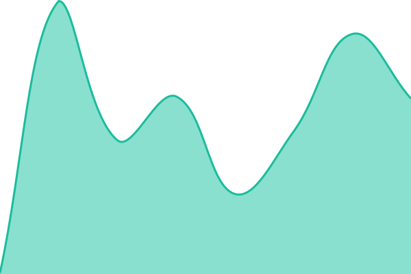
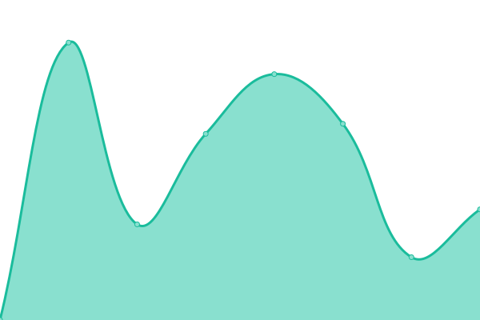
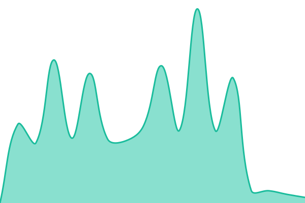

# [📈 Live Status](https://evolvepune.github.io/website-status): <!--live status--> **🟩 All systems operational**

This repository contains the open-source uptime monitor and status page for [Evolve Pune](https://evolvepune.github.io/website-status), powered by [Upptime](https://github.com/upptime/upptime).

With [Upptime](https://upptime.js.org), you can get your own unlimited and free uptime monitor and status page, powered entirely by a GitHub repository. We use [Issues](https://github.com/evolvepune/website-status/issues) as incident reports, [Actions](https://github.com/evolvepune/website-status/actions) as uptime monitors, and [Pages](https://evolvepune.github.io/website-status) for the status page.

<!--start: status pages-->
<!-- This summary is generated by Upptime (https://github.com/upptime/upptime) -->
<!-- Do not edit this manually, your changes will be overwritten -->
<!-- prettier-ignore -->
| URL | Status | History | Response Time | Uptime |
| --- | ------ | ------- | ------------- | ------ |
|  [Evolve Pune](https://evolvepune.com) | 🟩 Up | [evolve-pune.yml](https://github.com/evolvepune/website-status/commits/HEAD/history/evolve-pune.yml) | 

 509ms
     
 | 

<a href="https://evolvepune.github.io/website-status/history/evolve-pune">100.00%</a>
    

|  [Courses - Evolve Pune](https://courses.evolvepune.com/learn/) | 🟩 Up | [courses-evolve-pune.yml](https://github.com/evolvepune/website-status/commits/HEAD/history/courses-evolve-pune.yml) | 

 2363ms
     
 | 

<a href="https://evolvepune.github.io/website-status/history/courses-evolve-pune">100.00%</a>
    

|  [Iskcon Hinjewadi](https://iskconhinjewadi.com/) | 🟩 Up | [iskcon-hinjewadi.yml](https://github.com/evolvepune/website-status/commits/HEAD/history/iskcon-hinjewadi.yml) | 

 3234ms
     
 | 

<a href="https://evolvepune.github.io/website-status/history/iskcon-hinjewadi">85.46%</a>
    

<!--end: status pages-->

[**Visit our status website →**](https://evolvepune.github.io/website-status)

## 📄 License

- Powered by: [Upptime](https://github.com/upptime/upptime)
- Code: [MIT](./LICENSE) © [Anand Chowdhary](https://anandchowdhary.com), supported by [Pabio](https://pabio.com)
- Data in the `./history` directory: [Open Database License](https://opendatacommons.org/licenses/odbl/1-0/)
